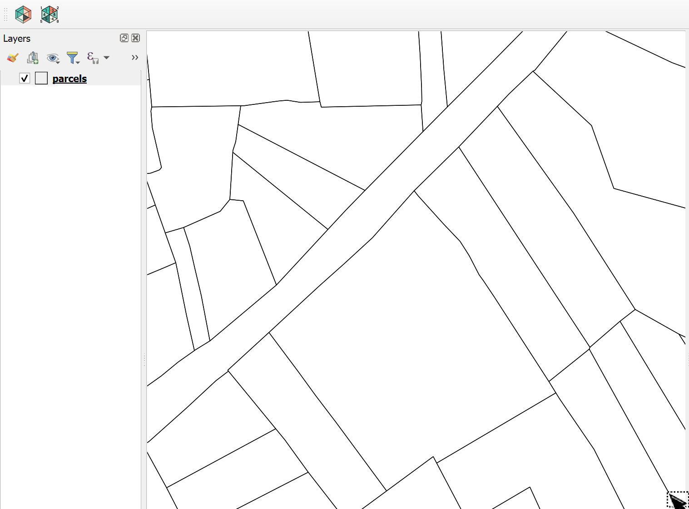

# Equalyzer

A QGIS plugin that splits polygons into equal parts, into parts of a given
area, or into parking bays. Runs on QGIS 3.16+ and QGIS 4.

## Install

Download the repository as a ZIP and use *Plugins ▸ Manage and Install
Plugins ▸ Install from ZIP*. GitHub's download unpacks to a folder named
`Equalyzer-main`; that works as it is, or rename it to `Equalyzer` first.

## Three modes

### Equal parts

1. Start *Split into Equal Parts*. Select a polygon first, or select nothing
   and let the direction line pick one (see below).
2. Draw a direction line on the map. Cuts run parallel to it.
3. Optionally click a start side; parts are numbered from there.
4. Enter the number of parts, preview, apply.

The parts have exactly equal area, to within rounding.

### Equal areas

The same, with a target area per part instead of a count. The last part
takes the remainder.

### Parking bays

Select the strips, or select nothing and draw a line over the strip you
mean, then press *Split into Parking Bays*. There is nothing to draw or
type after that:

- each strip is measured along its own axis, so a whole selection can be
  cut in one go
- the short side decides the orientation: a strip about 2.5 m deep holds
  bays head to tail and is cut every 5 m; a strip about 5 m deep holds them
  side by side and is cut every 2.5 m
- the count follows from the length, with a minimum bay size: a 17.86 m
  strip becomes three bays of 5.95 m, not four of 4.47 m
- the strip is then divided into that many equal parts, so drawing slack
  is spread out instead of left as a sliver

The dialog shows the plan per strip before anything is created and flags a
length that is not close to a whole number of bays, a depth that matches
neither bay size (you pick the orientation yourself), and a strip that is
too curved for a straight axis. Bay sizes and minimums are configurable and
remembered.

## Picking a polygon with the line

In every mode, if nothing is selected when you draw the direction line, the
polygon the line runs through over the greatest length is selected in the
layer, so you can see what was picked before previewing. Ties go to the
smaller polygon. An existing selection always wins.

## Output

Parts go to a memory layer named `Split Parts – <source layer>`. A later
split of the same source layer is appended to it, so a session's work stays
in one place. The layer is recognised by a custom property, so renaming it
is fine.

Each part gets `source_fid`, `part_id` (numbered per source polygon),
`area_val` and `area_txt`, followed by a copy of every attribute of the
source feature. A source field whose name clashes with one of those four is
prefixed with `src_`.

In parking-bay mode you can instead delete the original, or replace it in
the source layer by its bays. Adding the bays and removing the strip happen
inside one named edit command, so a single Ctrl+Z undoes the whole thing.
If the layer was already in edit mode the change joins that session and you
save it yourself; otherwise Equalyzer opens a session and commits it. The
choice is remembered and defaults to the safe one.

After a split the layer you split is the active layer again.

## Coordinate systems

Angles and distances cannot be computed in degrees: at 52° north a degree
of longitude covers 62 % of the ground distance of a degree of latitude, so
a right angle in the coordinates is not a right angle on the ground. For a
layer in a geographic CRS, Equalyzer transforms each feature into the UTM
zone of the data, measures and cuts it there, and transforms the parts
back. Projected layers such as RD New are used as they are. Areas are
always reported in square metres, converted to the project's area unit.

## How the splitting works

After rotating the polygon so the cuts are horizontal, the width of a
cross-section is linear between consecutive vertex heights, so the area
below a cut is piecewise quadratic and every cut position is one
closed-form solve. Parts are produced by intersecting the polygon with band
polygons, which tile the plane, so they always add up to the original. If
the project measures on the ellipsoid, the cuts are refined with a few
Newton steps using dA/dy = width(y).

A part that would consist of several separate pieces (a concave polygon cut
across its arms) is handed to a connected partitioner instead, and the
result message says so. For parking strips the axis is the direction that
makes the strip narrowest, found on the polygon's convex hull.

Both engines have pure-Python cores in `equal_parts.py` and `parking.py`.

## Tests

From the plugin folder:

    python -m unittest discover -s tests -v

This needs shapely, which serves as ground truth, and does not need QGIS.
Inside QGIS, `tests/qgis_console_check.py` runs the real engine on synthetic
polygons; instructions are at the top of that file.

## Diagnostics

Every step of a split can be logged to the *Equalyzer* tab of the Log
Messages panel. Enable it from the QGIS Python console and reload the
plugin:

    QSettings().setValue("Equalyzer/debug", True)

Errors always land in that panel with a full traceback.

## Credits and licence

Originally written by Abel Koszeghy
(https://github.com/danzig666/Equalyzer). This fork rewrote the splitting
engine, added parking-bay mode and QGIS 4 support. MIT licence, see
`LICENSE`.
