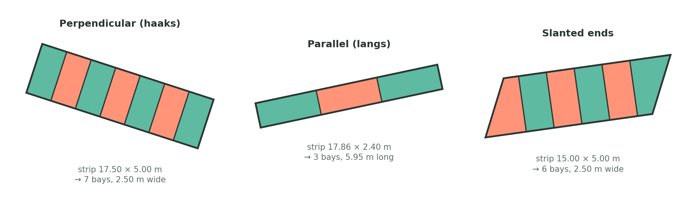

# Equalyzer

A QGIS plugin that splits polygons into equal parts, into parts of a given
area, or into parking bays. It works in QGIS 3.16 and later and in QGIS 4,
and in projected as well as geographic coordinate systems.

*Three strips as Equalyzer divides them. The orientation and the number of
bays come from the strips themselves; slanted ends stay with the outer
bays.*

## Features

- **Parking bays in one click.** Select one strip or many, or draw a line
  over a single strip. Equalyzer works out whether it holds perpendicular or
  parallel bays and how many, then cuts it square across its own axis.
- **Exactly equal parts.** Cut positions are solved in closed form from the
  polygon's area profile, so parts are equal to within rounding, not
  approximately.
- **Parts of a given area.** Repeated parts of a target size plus a
  remainder.
- **Attributes carried over.** Every part gets all attributes of the polygon
  it came from.
- **Replace in place.** In parking-bay mode the strip can be replaced by its
  bays in its own layer, as one undoable edit that you save yourself.
- **Any coordinate system.** Layers in degrees, Web Mercator or feet are
  measured and cut in metres, so bays are square on the ground.

## Requirements

- QGIS 3.16 or later, or QGIS 4. Developed and tested on QGIS 4.2.
- A polygon layer. Parking-bay mode assumes bay sizes in metres; the layer
  itself may be in any CRS.

## Installation

**From a release (recommended).** Download `Equalyzer-<version>.zip` from the
[Releases](https://github.com/jeroenrijsdijk/Equalyzer/releases) page. In
QGIS choose *Plugins ▸ Manage and Install Plugins ▸ Install from ZIP* and
select the file.

**From the repository ZIP.** *Code ▸ Download ZIP* on GitHub gives a folder
named `Equalyzer-main`. Unzip it, rename the folder to `Equalyzer`, zip it
again and install that. Without the rename it still works, but a later
update installs next to it instead of over it.

**From git.** Clone into the plugins folder of your QGIS profile. To find
that folder, choose *Settings ▸ User Profiles ▸ Open Active Profile Folder*
and go into `python/plugins`:

    cd "<profile folder>/python/plugins"
    git clone https://github.com/jeroenrijsdijk/Equalyzer.git

Restart QGIS and tick Equalyzer under *Plugins ▸ Manage and Install
Plugins ▸ Installed*.

The three actions appear on the *Equalyzer* toolbar and under *Plugins ▸
Equalyzer*.

## Parking bays

1. Make the parking layer active. Select the strips to divide, or select
   nothing.
2. Press **Split into Parking Bays**. With nothing selected, draw a line
   over the strip you mean; the strip is picked and selected for you.
3. Check the plan and press **Create bays**.

After that the tool you were digitising with is active again, and so is
the parking layer, so you can draw the next strip right away.

### How the bays are worked out

A bay is 5.00 m along the car and 2.50 m across it. The short side of a
strip says which of the two runs along its length:

| Strip depth | Bays | Cut every |
|---|---|---|
| about 2.5 m (2.0–3.0 m) | parallel, head to tail (langsparkeren) | 5.00 m |
| about 5.0 m (4.0–6.0 m) | perpendicular, side by side (haaksparkeren) | 2.50 m |
| anything else | not decided; you choose the orientation | |

The length alone cannot decide this, because a multiple of 5 is also a
multiple of 2.5.

The number of bays follows from the length, but not by plain rounding: a
bay shorter than the minimum is worse than a roomy one. Both neighbouring
counts are tried and the ones whose bays land between the minimum and 1.5
times the nominal size win; the nominal size decides between two that
qualify.

| Strip | Result |
|---|---|
| 17.86 × 2.40 m | 3 bays of 5.95 m, not 4 of 4.47 m |
| 14.40 × 2.40 m | 3 bays of 4.80 m, exactly the minimum |
| 14.20 × 2.40 m | 2 bays of 7.10 m, because 3 would be 4.73 m |
| 17.50 × 5.00 m | 7 bays of 2.50 m |
| 16.50 × 5.00 m | 6 bays of 2.75 m, because 7 would be 2.36 m |

The strip is then divided into that many parts of equal area, so a few
centimetres of drawing slack are spread over all bays instead of left as a
sliver at one end. The length is measured along the middle of the strip
(area ÷ depth), so slanted ends do not squeeze in an extra bay.

### The dialog

| Field | Default | Meaning |
|---|---|---|
| Bay length (along the car) | 5.00 m | nominal bay length |
| Shortest acceptable length | 4.80 m | parallel bays are never cut shorter than this if a roomier count exists |
| Bay width (across the car) | 2.50 m | nominal bay width |
| Narrowest acceptable width | 2.40 m | the same for perpendicular bays |
| Orientation | Automatic | force parallel or perpendicular for all selected strips, for instance when the depth is ambiguous |
| What to do with the result | Collect in Split Parts | or replace the strip in its own layer |

Below the fields the dialog lists the plan per strip, such as
`17.86 x 2.40 m -> 3 parallel bays of 5.95 x 2.40 m`, and flags:

- bays that come out more than 15 % off the nominal size, or a length for
  which no number of bays respects the minimum;
- a depth that fits neither bay size;
- a strip that fills less than 90 % of its bounding rectangle, which means
  slanted ends, a curve or a ragged outline.

All values are remembered between sessions.

## Equal parts and equal areas

**Split into Equal Parts** cuts a polygon into a number of parts of exactly
equal area. **Split into Equal Areas** cuts off parts of a target area,
with the remainder as the last part.

1. Select one or more polygons, or select nothing and let the direction
   line pick one.
2. Start the action and set *Number of parts* or *Target area per part*.
3. **Draw Direction Line…**: click two points. Cuts run parallel to this
   line. It snaps to vertices.
4. Optionally **Pick Starting Side…**: click inside the polygon on the side
   where numbering should start. Without it, numbering starts at the left
   or bottom.
5. **Preview** shows the parts on the map with their areas, **Apply**
   creates them.

*Precision* (1–5) only matters for concave polygons that straight cuts would
break into separate pieces; see *How the splitting works*. Higher values
give more even parts and take longer.

*The animation shows the original version of the plugin; the dialog has
changed since, the principle has not.*

## Picking a polygon with the line

When nothing is selected, the polygon the line runs through over the
greatest length is picked and selected in the layer, so you see what was
chosen before anything happens. Ties go to the smaller polygon. Redrawing
the line over another polygon picks that one instead. If the line crosses
nothing, the polygon under its first point is used. An existing selection
always wins, which is how you split several polygons at once.

While you draw, Equalyzer switches vertex snapping on for its own line only;
your snapping settings are back as they were once the line is drawn.

## Output

Parts go to a temporary layer named `Split Parts – <source layer>`. Later
splits of the same source layer are added to the same layer, so a session's
work stays together. The layer is recognised by a hidden property, so
renaming it is fine. Use *Make Permanent* on it to keep it outside the
project.

| Field | Content |
|---|---|
| `source_fid` | feature id of the polygon the part came from |
| `part_id` | 1, 2, 3 … per source polygon |
| `area_val` | area in the project's area unit |
| `area_txt` | the same as text, used for the labels |
| all source fields | copied from the source polygon |

A source field whose name clashes with one of the first four gets a `src_`
prefix. The source layer's primary key (such as a GeoPackage `fid`) is not
copied; `source_fid` holds it.

### Replacing the strip in its own layer

In parking-bay mode, *Replace the original in this layer with the bays*
writes the bays into the strip's own layer and removes the strip:

- the bays get all of the strip's attributes, except fields the data
  provider fills itself, such as a GeoPackage `fid`;
- they are converted to the layer's geometry type (single or multi, with Z
  or M if the layer has them);
- a strip that holds only one bay is left as it is;
- Equalyzer never saves the layer. The change goes into the edit buffer as
  one step: **Ctrl+Z** takes the whole split back, **Save Layer Edits**
  keeps it. Edit mode is switched on if it was off.

## Coordinate systems

Angles and distances only mean something in coordinates that are ground
metres. In degrees they are not: at 52° north a degree of longitude covers
62 % of the ground distance of a degree of latitude, so a right angle in the
coordinates is not a right angle on the ground. Web Mercator (EPSG:3857)
keeps angles but stretches lengths by 1/cos(latitude), 1.6 times in the
Netherlands, and a CRS in feet measures bays in the wrong unit.

Equalyzer therefore compares a short segment's length in the coordinates
with its length on the ellipsoid. If they differ by more than half a
percent, each feature is transformed into the UTM zone of the data, measured
and cut there, and transformed back; a direction you drew is converted with
it. Projected metric systems such as RD New (EPSG:28992) and UTM pass the
check and are used as they are.

Areas follow the project's ellipsoid setting (*Project ▸ Properties ▸
General*). When that is *None* but the layer's coordinates are not ground
metres, an ellipsoid is used anyway, so labels never show square degrees or
inflated Mercator areas.

## How the splitting works

After rotating the polygon so the cuts are horizontal, the width of a
cross-section is linear between consecutive vertex heights. The area below
a cut is therefore piecewise quadratic, and every cut position is one
closed-form solve instead of a search. Parts are produced by intersecting
the polygon with band polygons, which tile the plane, so the parts always
add up to the original. If areas are measured on the ellipsoid, the cuts
are refined with a few Newton steps using dA/dy = width(y), keeping the best
result.

When a straight cut would leave a part in separate pieces, such as a
U-shape cut across its arms, that polygon is handed to a connected
partitioner instead. Its parts are close to equal rather than exact, and
the result message says so. Drawing the direction line along the arms
usually avoids it.

For parking strips the axis is the direction in which the strip is
narrowest, found on its convex hull. The minimum-width strip around a
convex shape always lies flush with one of its edges, so trying every hull
edge is enough; for a parking strip that edge is the kerb.

## Settings

Stored with QGIS's own settings, under `Equalyzer/`:

| Key | Content |
|---|---|
| `bayLength`, `bayWidth` | nominal bay size |
| `minBayLength`, `minBayWidth` | minimum bay size |
| `bayOutput` | `collect` or `replace` |
| `precision` | precision for concave polygons, 1–5 |
| `dialogGeometry` | size and position of the dialog |
| `debug` | log every step, see *Diagnostics* |

## Known limitations

- Angled parking (schuinparkeren) is not recognised: such a strip is
  treated as perpendicular and cut every 2.5 m along the kerb.
- A curved strip has no straight axis. The dialog warns about strips that
  fill less than 90 % of their bounding rectangle; split a curved strip
  into straight pieces first.
- The metric work frame uses UTM, which is undefined beyond 84° north or
  south; there the layer's own coordinates are used.

## Development

    Equalyzer/
    ├── __init__.py            QGIS entry point
    ├── polygon_splitter.py    plugin, dialogs, map tools, apply path
    ├── equal_parts.py         exact equal-area slicer
    ├── parking.py             strip axis and bay planning
    ├── metadata.txt           plugin metadata and changelog
    ├── icon_*.png             toolbar icons
    ├── docs/                  images for this README
    └── tests/                 unit tests and QGIS stubs

`equal_parts.py` and `parking.py` have pure-Python cores; everything that
depends on a QGIS version sits in one compatibility block at the top of
`polygon_splitter.py`.

### Tests

    pip install shapely PyQt6
    python -m unittest discover -s tests -v

Run this from the plugin folder. Shapely serves as ground truth; QGIS is not
needed. `test_engine.py` imports the plugin itself against a stubbed QGIS
and needs PyQt6 or PyQt5; without either it is skipped.

The stubs model the QGIS API as the plugin uses it, so they catch logic
errors but not differences between QGIS versions. Inside QGIS,
`tests/qgis_console_check.py` runs the real engine on synthetic polygons;
the instructions are at the top of that file.

### Diagnostics

Every step of a split can be logged to the *Equalyzer* tab of the Log
Messages panel. Enable it from the QGIS Python console and reload the
plugin:

    from qgis.PyQt.QtCore import QSettings
    QSettings().setValue("Equalyzer/debug", True)

Errors always go to that panel with a full traceback.

### Making a release

Raise `version` in `metadata.txt`, add a changelog entry there, commit, and
build the ZIP with the folder name QGIS expects:

    git archive --format=zip --prefix=Equalyzer/ -o Equalyzer-<version>.zip HEAD

Attach that file to a GitHub release.

## Changelog

The changelog is kept in `metadata.txt`, so the QGIS plugin manager shows it
too.

## Issues and contact

Report problems at https://github.com/jeroenrijsdijk/Equalyzer/issues, or
mail Jay at jri@rvmk.nl. When a split goes wrong, the *Equalyzer* tab of the
Log Messages panel usually says why; please include it.

## Credits and licence

This is a fork of Equalyzer by Abel Koszeghy
(https://github.com/danzig666/Equalyzer), maintained by Jay. The fork
rewrote the splitting engine and added parking-bay mode and QGIS 4 support.
MIT licence, see `LICENSE`.

## In het kort

Equalyzer is een QGIS-plugin die vlakken in gelijke delen knipt, en
parkeerstroken in losse parkeervakken. Selecteer een strook of trek er een
lijn overheen, druk op *Split into Parking Bays*: de plugin ziet aan de
diepte of het om haaks- of langsparkeren gaat, bepaalt het aantal vakken
met een minimummaat (standaard 4,80 × 2,40 m) en knipt haaks op de strook.
De vakken nemen alle attributen van de strook over en kunnen de strook in de
eigen laag vervangen, als één stap die je met Ctrl+Z terugdraait. Werkt in
RD, in WGS84 en in Web Mercator.
